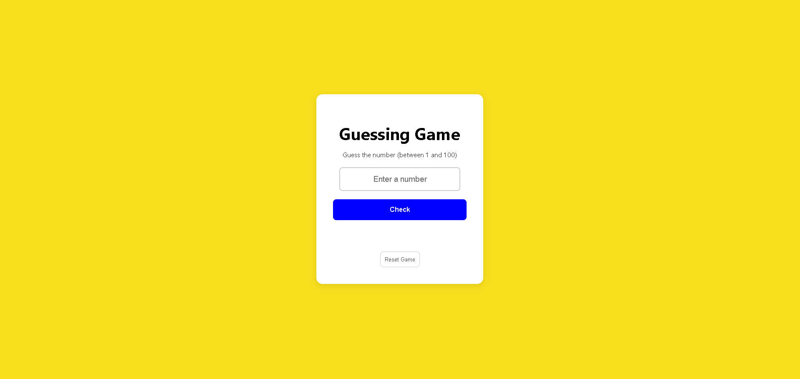

# 🎮 Number Guessing Game 
¡Bienvenido a mi primer proyecto de lógica con JavaScript! Es un juego sencillo donde debes adivinar un número aleatorio entre **1 y 99**.

## 🚀 Demo
Puedes probar el proyecto funcionando aquí:
👉 [**CLICK HERE TO PLAY**](https://github.io)

---

## 📝 Descripción
Este es un proyecto de práctica para fortalecer mis conocimientos básicos en desarrollo web. El juego genera un número secreto y te da pistas si tu número es muy alto o muy bajo.

### Características:
*   Validación de números del 1 al 99.

## 🛠️ Tecnologías usadas
*   **HTML5:** Estructura de la página.
*   **CSS3:** Estilos y diseño responsivo.
*   **JavaScript:** Lógica del juego y manipulación del DOM.

## 📸 Preview

---
Hecho con ❤️ por [CLICK HERE PLEASE <3](https://josuevasquez2305.github.io/Guessing-game/)
